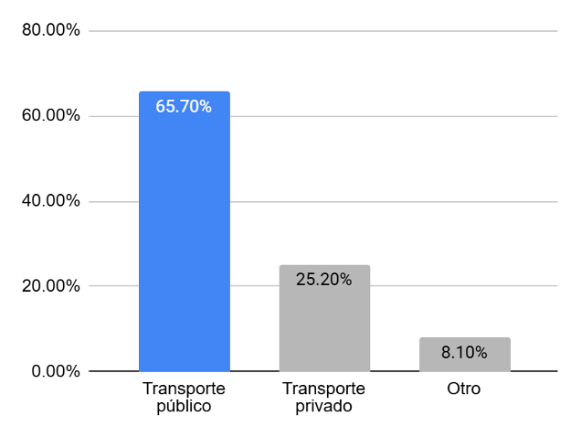
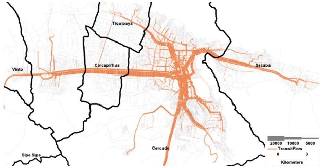

# 2. Planteamiento del problema

El transporte público es vital en la vida de las personas, especialmente cuando no disponen de un vehículo privado para movilizarse, como es el caso de la mayor parte de la población de Cochabamba, donde sólo un 37.2% posee un vehículo automotor o motocicleta (Instituto Nacional de Estadística INE, 2015) y, como se observa en la Figura 1, el 65.7% de la población utiliza el transporte público como principal medio para movilizarse en el día a día (Cabrera et al., 2018). En estas circunstancias, es esencial para la población saber cómo movilzarse entre todas las líneas disponibles (Holguin et al., 2019).

**Figura 1.** Medio de transporte utilizado por la población de Cochabamba

Fuente. Elaboración propia, 2026, con base en Cabrera et al., 2018.

Sin embargo, como señalan Cabrera et al. (2018), si bien la regulación del transporte público urbano, incluyendo la autorización de líneas, rutas y tarifas, recae formalmente en el Gobierno Autónomo Municipal de Cochabamba, en la práctica la operación del servicio se encuentra descentralizada, siendo la excepción el tren metropolitano. Esto se debe, en parte, al Decreto Supremo Nº 21660 de Reactivación Económica, que permite que cualquier persona natural o jurídica preste libremente servicios de transporte urbano público siempre que se cumplan los requisitos de seguridad y de protección al usuario artículo N° 176.

Esta forma de organización del transporte público, caracterizada por una regulación formal sin una gestión centralizada de la información operativa, hace que el mapeo actualizado de las rutas de movilización resulte complicado. Como consecuencia, aplicaciones como Google Maps o Moovit, que ofrecen información sobre el transporte público en diversos países, no pueden operar de manera adecuada en Bolivia. De este modo, los ciudadanos carecen de acceso a conocimiento sobre las líneas disponibles, sus rutas, horas de operación y conexiones.

Considerando que en Cochabamba se realizan cerca de 2 millones de viajes diarios (Cabrera & Moyano, 2022), y que en más del 40% de hogares hay al menos un integrante que se traslada diariamente entre municipios (Cabrera, 2017), es vital contar con un medio que provea toda esta información faltante, especialmente para los municipios más frecuentados, cuyas rutas más concurridas se pueden observar en la Figura 2.

**Figura 2.** Flujos de transporte en la región metropolitana de Cochabamba

Fuente. Cabrera & Moyano, 2022.

Anteriormente se propusieron soluciones como Llajta Rutas (Cabrera et al., 2018) y Trufi (Trufi Association, 2025), ambas aplicaciones móviles con mapeo de las líneas y rutas disponibles en Cochabamba;  con Llajta Rutas usando crowdsourcing para construir dicho inventario, mientras Trufi lo construyó de forma independiente. Ambas aplicaciones recibieron buena acogida del público, Trufi llegando a 100 mil descargas a la fecha (Google Play, 2023) y Llajta Rutas con 10 mil descargas entre 2017 y 2018 (Cabrera et al., 2018).

No obstante, lamentablemente ambas aplicaciones dejaron de recibir soporte y mantenimiento activo. Llajta Rutas ya no se encuentra disponible en Play Store y fue descontinuada debido a falta de apoyo económico (Cabrera, comunicación personal, 28 de diciembre de 2025). Por otro lado, aunque Trufi aún se encuentra disponible en Play Store, su última actualización fue el 14 de diciembre de 2023 (Google Play, 2023), y se observan comentarios recientes mencionando la falta de:

* Distinción de colores de líneas, puesto que una misma línea puede tener diferentes rutas.
* Actualización de líneas disponibles y sus respectivas rutas y tarifas a lo largo del tiempo.
* Paradas y horarios del nuevo tren metropolitano de Cochabamba.

Además, cabe recalcar que las bases de datos que ambas aplicaciones recolectaron sobre las rutas están cerradas al público, por lo que no se las puede extender o consultar con un sistema externo.

En síntesis, la falta de una fuente centralizada y abierta de información actualizada sobre las rutas del transporte público en el área metropolitana de Cochabamba representa una limitación significativa para la movilidad cotidiana de la población. Si bien han existido iniciativas previas que evidencian la utilidad y aceptación de este tipo de herramientas, la ausencia de mecanismos sostenibles para la recolección y mantenimiento de la información ha impedido su continuidad en el tiempo. Esta situación pone de manifiesto la necesidad de una solución que permita recolectar y centralizar de manera colaborativa la información de rutas del transporte público, asegurando su actualización y disponibilidad a largo plazo.

## 2.1 Formulación del problema

El presente proyecto busca proponer una solución a las necesidades descritas, por lo que surge la pregunta: ¿Cómo desarrollar un sistema móvil multiplataforma que, mediante crowdsourcing, permita recolectar y centralizar información de rutas del transporte público en el área metropolitana de Cochabamba?